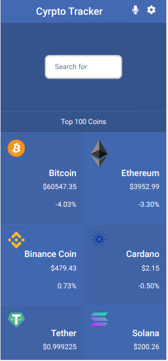
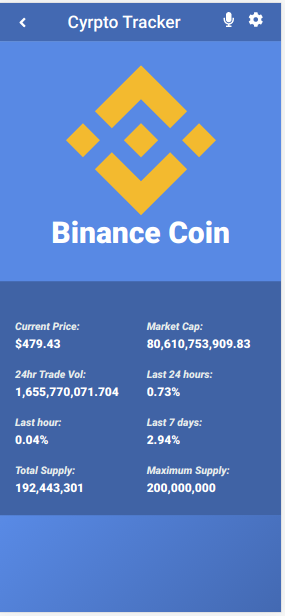

# Crypto Tracker(Mobile focused)

React App that allows anyone to keep track of the top 100 Crpto currencies. Details such as 
- Name
- Logo
- Current Price
- Change in last 24 hours
- Change in last 7 days
- Change in last 1 hour
- Markte Capitalisation
- Volume of transactions

 The App contain an input field to find different currencies by name

The app consist of 2 pages. 

- Home page: Shows the list of the top 100 Crypto currencies with basic details
- Details page: Shows details of each individual Crytpto currency when it is clicked on.

Original design idea by: [Nelson Sakwa on Behance](https://www.behance.net/sakwadesignstudio)

Flag pictures are from website [www.countryflags.io](https://www.countryflags.io/)

  

## Built With

- JavaScript
- HTML & CSS
- Bootstrap
- Webpack
- Jest testing framework
- Git and Github pages
- VSCode
- Linter Checkers

## Deployment Live Demo

Deployed with Netlify
  - [Live Demo](https://quirky-wiles-dc9047.netlify.app//)

## Getting Started

To get a local copy up and running follow these simple example steps.

### Prerequisites

- IDE to edit and run the code (We use Visual Studio Code 🔥).
- [Node.js](https://nodejs.org/en/download/) already downloaded.

### Install

To get a local copy up and running follow these simple example steps.
- Open terminal
- Clone this project using the command
```
git clone https://github.com/AdedayoOpeyemi/crypto_tracker
```
- Select the folder
```
cd crypto_tracker
```
- To install all project dependencies run:
```
npm install
```
- To start the local server run:
```
npm start
```

### Run Test Locally
To run all the test, type on the terminal:
```
npm run test
```
## Authors

👨‍💻 **Opeyemi Oyelesi**

- GitHub: [@AdedayoOpeyemi](https://github.com/AdedayoOpeyemi)
- Twitter: [@Oyelesiopy](https://twitter.com/oyelesiopy)
- LinkedIn: [Opeyemi Oyelesi](https://linkedin.com/in/opeyemioyelesi)


## 🤝 Contributing

Contributions, issues, and feature requests are welcome!

Feel free to check the [issues page](https://github.com/AdedayoOpeyemi/crypto_tracker/issues).

## Show your support

Give a ⭐️ if you like this project!


## Acknowledgments

- Hat tip to anyone whose code was used 🔰
- Inspiration 💘
- Microverse program ⚡
- Our standup team 🏹
- Our family's support 🙌

## 📝 License

This project is [MIT](./LICENSE) licensed.